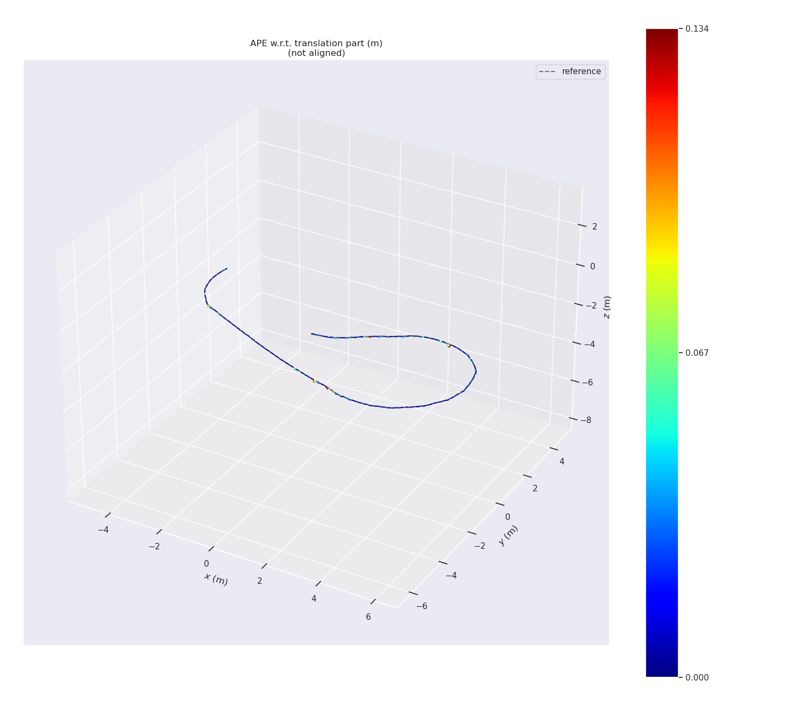
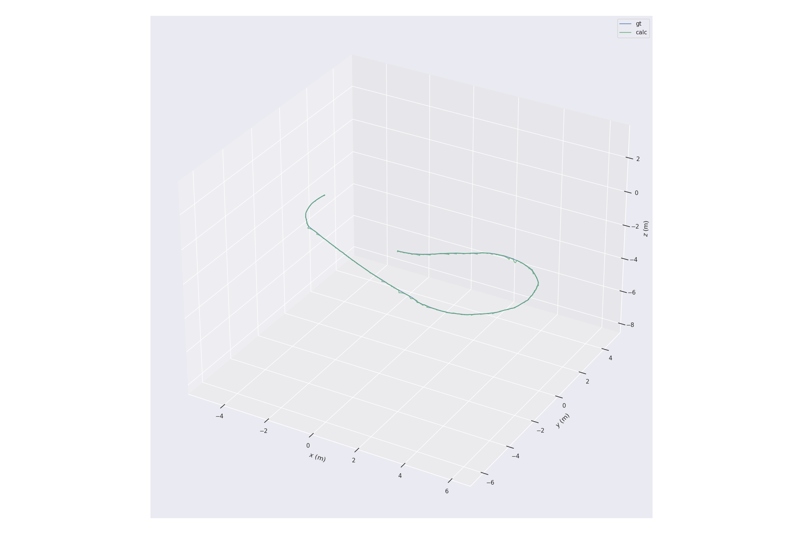
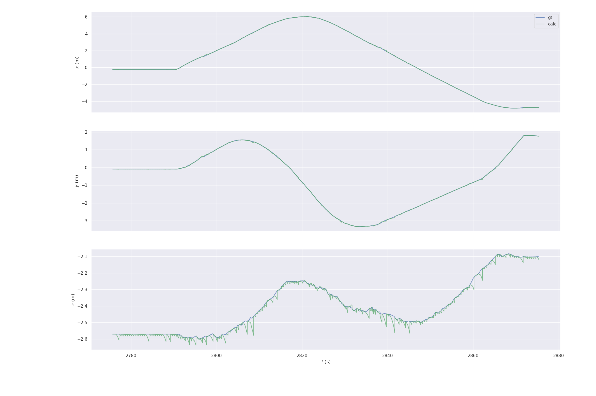
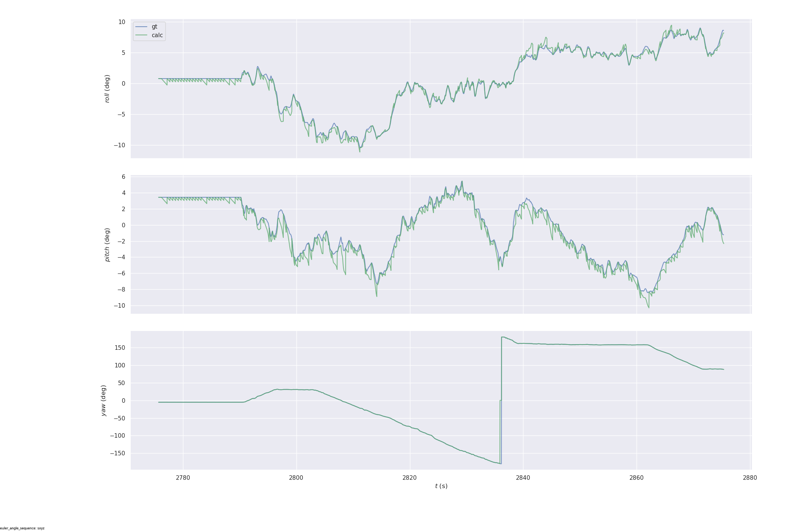

# IMU-Aided-Odometry
Odometry Trajectory Recursion Based on IMU Integral Interpolation.

## Notice
* This repository is heavily based on ETH's odom predictor package https://github.com/ethz-asl/odom_predictor and Abin1258's https://github.com/Abin1258/imu_to_odom.
* Compared with the original versions, we have increased the monitoring of the odometry topic to eliminate the cumulative error.
* We fixed bugs in Abin1258's repo in the transformation from the orientation matrix to the quaternion.

## Overall I/O

### Input
* High frequency IMU topic (50Hz)
* Low frequency Odometry topic (1Hz)
### Output
* High frequency pose trajectory after IMU estimation and Odometry correction

## Method
### Orientation estimation

$$
{\Delta R} ={  
{\begin{bmatrix}
{{{0}}}&
{{{-w_z\times\Delta t}}}&
{{{w_y\times \Delta t}}}\\

{{{w_z\times\Delta t}}}&
{{{0}}}&
{{{-w_x\times\Delta t}}}\\

{{{-w_y\times\Delta t}}}&
{{{w_x\times\Delta t}}}&
{{{0}}}
\end{bmatrix}} },
$$

$$
\sigma = \sqrt{w_x^2 + w_y^2 + w_z^2} \times \Delta t,
$$

$$
R_t  =R_{t-1}\times (\mathbf{I}_3 + \frac{sin(\sigma)}{\sigma}\times \Delta R - \frac{1-cos(\sigma)}{\sigma^2}\times \Delta R^2),
$$

$$
v_t = v_{t-1} + \Delta t \times (R_t \times a_{imu} - g),
$$

$$
pos_t = pos_{t-1} + \Delta t \times v
$$

### Drift correction
* Use the pose information from Odometry topic to cover the current pose vector.
* Velocity correction:
    * Assume that $|v_{mid}| = |v_{t}|$
    * $v_{mid} = \frac{Pos_{t} - Pos_{t-1}}{\Delta t}$
    * $v_t = R_t\times R_{t-1}^{-1}\times v_{mid}$

## Experimental verification
* RMSE/Length = 0.10156%

